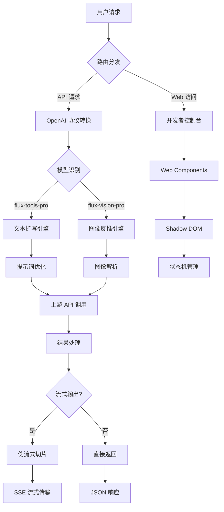
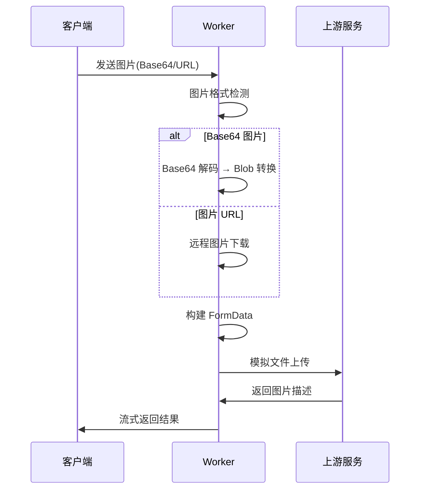
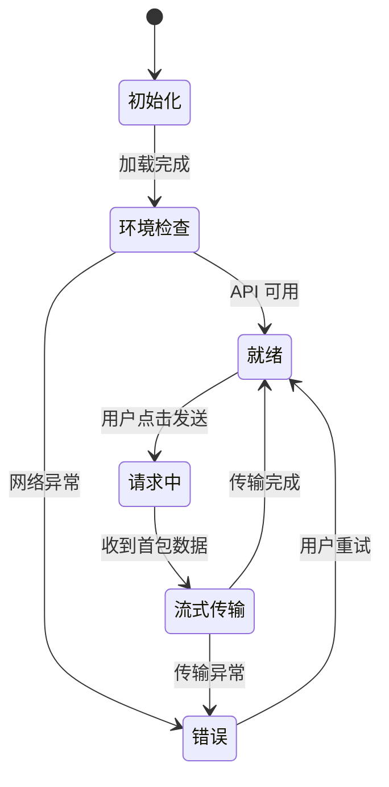
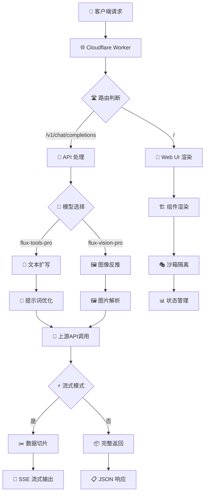
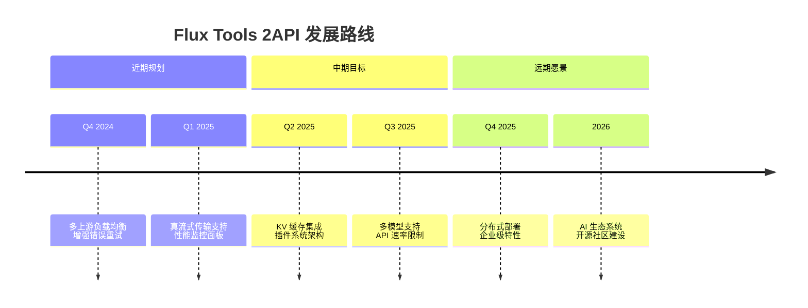

# 🌌 Flux Tools 2API (Cloudflare Worker 版本)

[](https://opensource.org/licenses/Apache-2.0)
[](https://workers.cloudflare.com/)
[]()
[]()

> **"为开发者打造如同 F1 赛车驾驶舱般的工具——信息密集、响应迅捷、绝对可靠。"**

欢迎来到 **Flux Tools 2API**。这不是一段简单的代码，这是一座连接 **Flux1.1** 强大提示词工程能力与 **OpenAI 生态系统** 的光桥。我们利用 Cloudflare 的边缘计算能力，将上游的 Web 工具无损转化为标准的 API 接口。

---

## 📖 目录导航

1.  [项目哲学与愿景](#-项目哲学与愿景)
2.  [核心技术栈解析](#-核心技术栈解析)
3.  [功能特性](#-功能特性)
4.  [🚀 一键部署教程](#-一键部署教程)
5.  [🛠️ 技术原理深度解构](#️-技术原理深度解构)
6.  [🎨 UI/UX 设计美学](#-uiux-设计美学)
7.  [🏗️ 项目架构蓝图](#️-项目架构蓝图)
8.  [🚧 局限性与未来规划](#-局限性与未来规划)
9.  [💌 致未来的开发者](#-致未来的开发者)

---

## 🧘 项目哲学与愿景

在数字荒原上，工具的碎片化阻碍了创造力的流动。**Flux Tools 2API** 的诞生，旨在打破这种隔阂。

*   **连接性**: 将封闭的网页工具解放为通用的 API
*   **极简主义**: 单文件架构，无服务器负担，部署即忘
*   **赋能**: 让每一位开发者都能轻松驾驭顶级的 AI 提示词工程能力

我们相信，**代码不仅是逻辑的堆砌，更是对秩序与效率的赞美诗。**

---

## 🔬 核心技术栈解析

本项目采用极其精简但高效的技术组合，实现了"四两拨千斤"的效果：

| 技术组件 | 评级 | 核心功能描述 |
| :--- | :---: | :--- |
| **🛠️ Cloudflare Workers** | ⭐⭐⭐⭐⭐ | **边缘计算引擎** - 代码运行在全球边缘节点，无需购买服务器，无需运维部署 |
| **🎭 Anonymous Access** | ⭐⭐⭐⭐⭐ | **匿名访问技术** - 无需注册上游账号，自动处理会话管理 |
| **🕵️ Header Spoofing** | ⭐⭐⭐⭐ | **指纹伪装** - 模拟真实浏览器指纹，绕过上游安全检查 |
| **⚡ Pseudo-Streaming** | ⭐⭐⭐⭐ | **伪流式响应** - 将一次性结果切片，实现打字机效果 |
| **🖼️ Multi-modal Handling** | ⭐⭐⭐⭐ | **多模态处理** - 自动识别并处理图片内容 |
| **📦 Shadow DOM** | ⭐⭐⭐ | **前端沙箱** - 确保样式隔离，组件化开发 |

---

## ✨ 功能特性

### ✅ 已实现功能
1.  **📝 文本扩写**: 输入简单词汇，输出 Flux 绘画专用的详细提示词
2.  **🖼️ 图像反推**: 上传图片，AI 自动分析并生成图片描述
3.  **🔌 OpenAI 兼容**: 完美支持标准 API 格式，可接入主流客户端
4.  **🎮 开发者控制台**: 内置 Web UI，支持实时测试和预览
5.  **🛡️ 智能错误处理**: 自动解析上游错误，提供友好报错信息

### ⚖️ 优缺点分析
*   **🌟 优势**: 完全免费、无需服务器、无需 Cookie、响应快速、隐私安全
*   **⚠️ 限制**: 依赖上游服务稳定性、Cloudflare 免费版有每日请求限制

---

## 🚀 一键部署教程

> **"只需三步，拥有专属的 AI 提示词网关"**

### 方法一：复制粘贴部署（推荐新手）

1.  **📝 注册 Cloudflare 账户**
    - 访问 [dash.cloudflare.com](https://dash.cloudflare.com/)
    - 完成账号注册和验证

2.  **⚙️ 创建 Worker 服务**
    ```bash
    # 在 Cloudflare 控制台：
    # 1. 点击 Workers & Pages
    # 2. 选择 Create Application  
    # 3. 点击 Create Worker
    # 4. 输入服务名称（如：flux-api）
    ```

3.  **💻 注入核心代码**
    ```javascript
    // 在代码编辑器中：
    // 1. 清空默认代码
    // 2. 复制本项目 worker.js 的全部内容
    // 3. 粘贴到编辑器中
    // 4. 点击 Deploy 部署
    ```

4.  **🎉 部署完成**
    - 您的 API 地址：`https://您的worker名称.您的子域名.workers.dev`

### 方法二：环境变量配置（进阶安全）

1.  **🔐 设置 API 密钥**
    ```bash
    # 在 Worker 设置中：
    # Settings → Variables → Environment Variables
    # 添加变量：API_MASTER_KEY = "您的自定义密钥"
    ```

2.  **🔄 重新部署生效**

---

## 🛠️ 技术原理深度解构

### 🎯 核心架构流程图



### 🔄 协议转换机制

**输入** (OpenAI 格式):
```json
{
  "model": "flux-tools-pro",
  "messages": [
    {"role": "user", "content": "一只在星空下的猫"}
  ]
}
```

**转换过程**:
```javascript
// 1. 提取核心内容
const userMessage = messages.find(m => m.role === 'user');
const prompt = userMessage.content;

// 2. 重组为上游格式
const upstreamData = {
  prompt: prompt,
  language: "zh",
  // 自动添加时间戳和指纹
  _t: Date.now()
};
```

**输出** (上游响应):
```json
{
  "result": "一只优雅的黑色猫咪，站在绚丽的银河系星空下，✨星星闪烁，🌌深蓝色的夜空中有粉红色的星云..."
}
```

### 🖼️ 多模态视觉处理



### ⚡ 伪流式技术实现

```javascript
// 创建转换流实现打字机效果
const { readable, writable } = new TransformStream();
const writer = writable.getWriter();

// 上游数据到达后
async function pushStream() {
  const text = upstreamResponse.result;
  for (let i = 0; i < text.length; i++) {
    await new Promise(resolve => setTimeout(resolve, 20));
    const chunk = {
      choices: [{
        delta: { content: text[i] },
        index: 0,
        finish_reason: null
      }]
    };
    writer.write(`data: ${JSON.stringify(chunk)}\n\n`);
  }
  writer.write('data: [DONE]\n\n');
  writer.close();
}
```

---

## 🎨 UI/UX 设计美学

### 🎯 设计理念
- **深色主题**: `#121212` 背景色，保护视力，专业感十足
- **状态驱动**: 严格的状态机管理，确保界面响应一致性
- **组件隔离**: Shadow DOM 实现样式封装，避免冲突

### 📱 界面状态流转


### 🎪 交互亮点
- **实时预览**: 图片上传即时显示
- **一键复制**: 配置信息快速复制
- **智能验证**: 自动检测 API 端点可用性
- **响应式设计**: 适配桌面和移动设备

---

## 🏗️ 项目架构蓝图

### 📁 逻辑架构层次

```
🎯 Flux Tools 2API 架构
├── 🔧 核心配置层
│   ├── 🗝️ API 密钥管理
│   ├── 🌐 上游服务端点
│   └── 🤖 模型注册表
│
├── 🚀 请求处理层  
│   ├── 🛣️ 路由分发器
│   ├── 🎭 协议适配器
│   └── 🛡️ 全局异常处理
│
├── 🔌 业务逻辑层
│   ├── 📝 文本扩写引擎
│   ├── 🖼️ 图像反推引擎
│   └── ⚡ 流式转换器
│
├── 🛠️ 工具服务层
│   ├── 🖼️ 图片加载器
│   ├── 🔄 数据转换器
│   └── 🌍 跨域处理器
│
└── 🎨 前端展示层
    ├── 🏗️ Web Components
    ├── 🎭 Shadow DOM 沙箱
    └── 🎮 状态机控制器
```

### 🔄 数据流转示意图



---

## 🚧 局限性与未来规划

### ⚠️ 当前限制
1.  **⏱️ 超时限制**: 免费版 Worker 有 10ms CPU 时间限制，处理大图片可能超时
2.  **🔗 上游依赖**: 服务稳定性依赖 flux1-1.ai 的可用性
3.  **📊 并发限制**: 免费版每日 10 万请求限制

### 🗺️ 未来发展路线图



### 🎯 具体改进计划
- **🔄 负载均衡**: 集成多个上游源，提高服务稳定性
- **💾 缓存优化**: 利用 Cloudflare KV 存储热点数据
- **🔧 插件架构**: 支持用户自定义处理逻辑
- **📈 监控告警**: 实现服务状态实时监控

---

## 💌 致未来的开发者

> "代码是写给人看的，只是顺便让机器执行。"

如果您阅读到这里，说明您对技术有着执着的追求。这个项目虽然体量小巧，但它完整展现了**现代 Web 开发的精髓**：

- **🌐 边缘计算**的巧妙运用
- **🔄 协议转换**的艺术处理  
- **⚡ 流式传输**的性能优化
- **🎨 组件化**的前端工程

### 🛠️ 建议的改进方向
1.  **界面定制**: 修改颜色主题，打造个性化控制台
2.  **功能扩展**: 集成翻译服务，支持多语言提示词
3.  **性能优化**: 添加请求缓存，减少上游调用
4.  **监控增强**: 集成日志分析和性能监控

### 🌟 开源精神
我们相信，**技术的价值在于分享，创新的动力来自社区**。每一个改进、每一次分享，都在推动整个生态向前发展。

**现在，轮到你创造奇迹了！**

---

## 🔗 项目链接

- **📂 源码仓库**: [https://github.com/lza6/flux-tools-2api-cfwork](https://github.com/lza6/flux-tools-2api-cfwork)
- **🐛 问题反馈**: [GitHub Issues](https://github.com/lza6/flux-tools-2api-cfwork/issues)
- **💡 功能建议**: [Discussion 讨论区](https://github.com/lza6/flux-tools-2api-cfwork/discussions)

---

*文档生成：首席 AI 技术官 | 奇美拉项目组*  
*最后更新：2025年11月23日 04:07:46*
